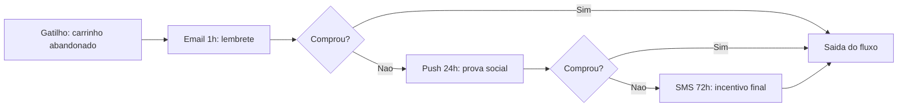

# Diagramas Mermaid — Visualização da Jornada

Baseado na skill de diagramação de **C3po_luke**. Toda entrega termina com um dashboard HTML contendo o diagrama da jornada em Mermaid.js, editável.

## Diretrizes obrigatórias de sintaxe

1. Código sempre dentro de bloco isolado abrindo com ```` ```mermaid ```` e fechando com ```` ``` ```` (no chat) ou em `<pre class="mermaid">` (no HTML).
2. IDs de nós simples e alfanuméricos, sem espaços: `A`, `B`, `Push1`, `Email2`.
3. **Nunca** usar caracteres especiais — parênteses, chaves, colchetes, aspas, `%`, `>` — dentro do texto visível de um nó, a menos que o texto inteiro esteja entre aspas duplas. Ex.: `A["Push D-1: lembrete 24h"]`.
4. Processos e funis usam `graph TD` (top-down) ou `graph LR` (left-right).
5. **Sem estilos inline** — nada de `style`, `classDef`, `linkStyle`. Entregar apenas a estrutura lógica; o frontend/tema cuida das cores.
6. Diagramas enxutos: só os nós que respondem à pergunta. Poluição visual mata a leitura.

## Padrões para jornadas de CRM

**Régua linear com condição de saída** (`graph LR`):



**Jornada com contagem regressiva** (`graph TD`): um nó por marco (D-15, D-7, D-3, D-0, D+3), canal indicado no texto do nó, decisões de conversão entre marcos.

**Segmentação/split**: nó de decisão único ramificando em trilhas por segmento; evitar mais de 4 ramos no mesmo diagrama — se passar, quebrar em diagramas separados.

Convenções:
- Prefixar o texto do nó com o canal e o timing: `Email D-7: historia completa`.
- Nós de decisão `{}` só para condições reais de fluxo (converteu, abriu, engajou).
- Sempre representar a saída do fluxo e as supressões — é o que diferencia um diagrama de régua de um fluxograma genérico.
- Acentos podem quebrar em alguns renderizadores; se houver risco, escrever sem acento ou envolver em aspas duplas.

## Dashboard HTML com Mermaid editável

O documento de entrega (ver `entrega-html.md`) termina com uma seção **"Jornada visual"** contendo:

1. **Diagrama renderizado** — `<pre class="mermaid">` com o código. Em Artifacts do Claude e em ferramentas com Mermaid nativo, renderiza direto sem biblioteca externa.
2. **Painel de edição** — `<textarea>` com o código-fonte do diagrama, botão **"Renderizar"** e botão **"Copiar código"**. Fluxo de edição:
   - Se a página tiver Mermaid disponível no runtime, re-renderizar in-place ao clicar em Renderizar.
   - Caso contrário, o botão copia o código e oferece link para `https://mermaid.live` para edição visual e export (PNG/SVG).
3. **Fallback obrigatório**: o código-fonte sempre visível/copiável em texto, para o diagrama nunca ser um beco sem saída se a renderização falhar.

Regras do dashboard: autocontido (CSS/JS inline, sem CDN em contexto de Artifact), tema claro e escuro, `overflow-x: auto` no container do diagrama, e o painel de edição recolhido por padrão (`<details>`) para não competir com o diagrama.

## No chat

Além do HTML, incluir o bloco ```` ```mermaid ```` no final da resposta em texto — assim o usuário vê a jornada mesmo sem abrir o documento.
